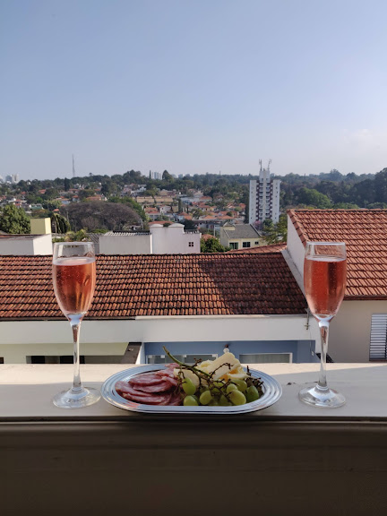
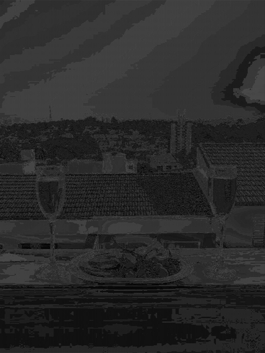

# ASCII Art
> A simple program that turns images into ASCII-art


## Instructions:

1. Upload an image to the `img` directory.

2. Update configs at the beginning of the script.
- `IMAGE_IN_PATH`: path to original image
- `IMAGE_OUT_PATH`: path to generated image
- `STRATEGY`: strategy to map RGB values to brightness *(default = 1)*
    - 1 = Average
    - 2 = Luminosity
    - 3 = Lightness
- `OUTPUT`: whether to create a new image or print to terminal *(default = 1)*
    - 1 = Image
    - 2 = Terminal
- `FONT_SIZE`: font size of ASCII characters *(default = 8)*
- `FONT`: font family *(default = DejaVuSansMono)*
- `MAX_WIDTH`: maximum width allowed for conversion *(default = 400)*
    - If the image's width is greater than this value, image size is reduced

3. Run the script.
```py
python3 script.py
```

## Example
Original Image:



ASCII Image:



## Credits
Inspired by: [Robert Heaton's Programming Projects For Advanced Beginners](https://robertheaton.com/2018/06/12/programming-projects-for-advanced-beginners-ascii-art/)
